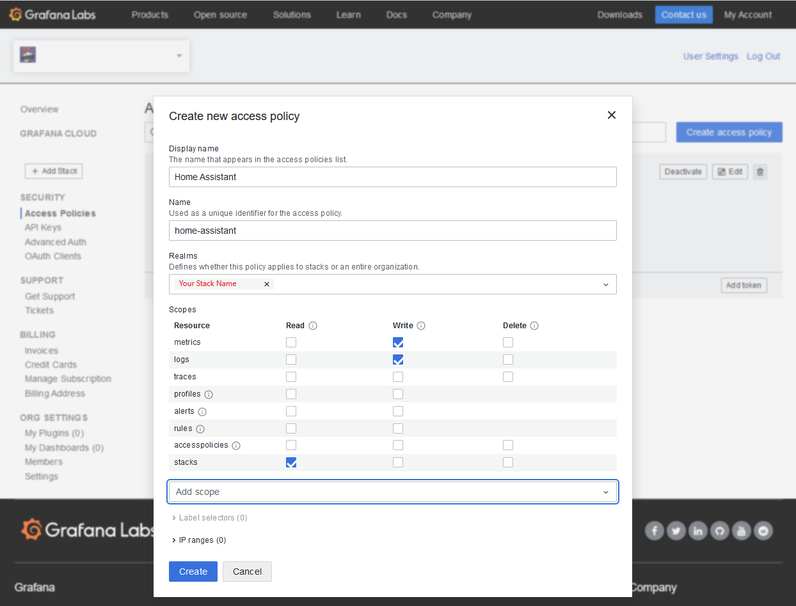
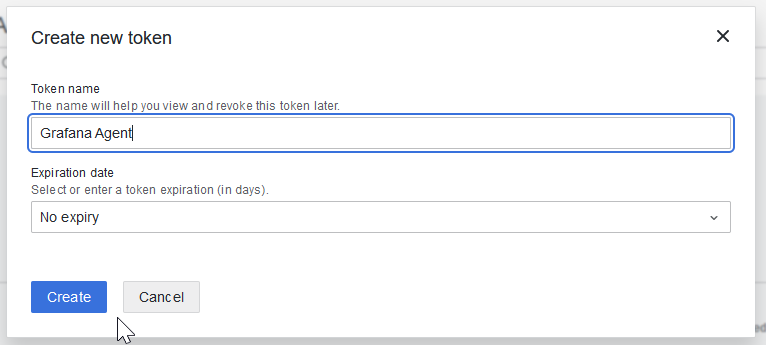

# Home Assistant Add-on: Grafana Cloud

Easily export Home Assistant stats to Grafana Cloud

## About

This addon makes it easy to export Home Assistant metrics and logs to Grafana Cloud

It will gather stats from your Home Assistant install and export them to Grafana Cloud where you can build beautiful custom dashboards.

## Setup

To configure the addon, first create a [Grafana Cloud](https://grafana.com/products/cloud/) account and set up your stack.

Copy the stack name, and paste it into the stack name field in the addon configuration.

Next you need to create a new Access Policy:

- Display Name: Home Assistant
- Name: home-assistant
- Realms: <your stack>
- Scopes:
  - Metrics: write
  - Logs: write
  - Stacks: read

Finally, add a token to the policy.

Copy the token, and paste it into the token field in the addon configuration.

[grafana]: https://grafana.com
[grafana-cloud]: https://grafana.com/products/cloud/
[grafana-agent]: https://grafana.com/docs/agent/latest/
[integration]: https://grafana.com/solutions/home-assistant/monitor/
